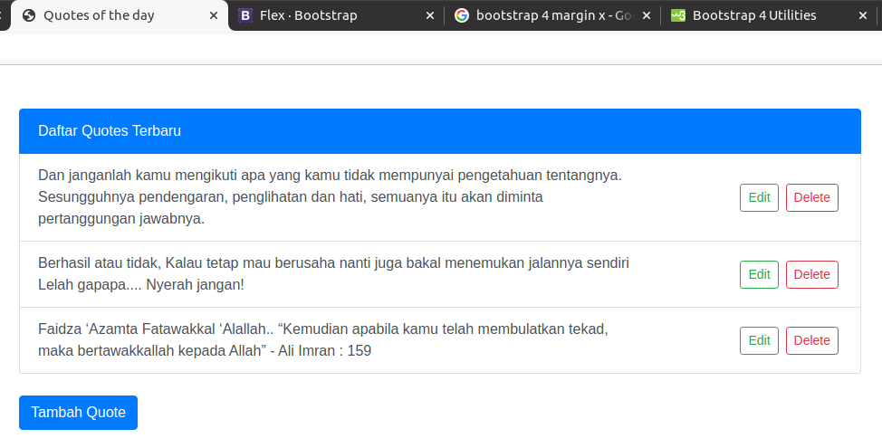
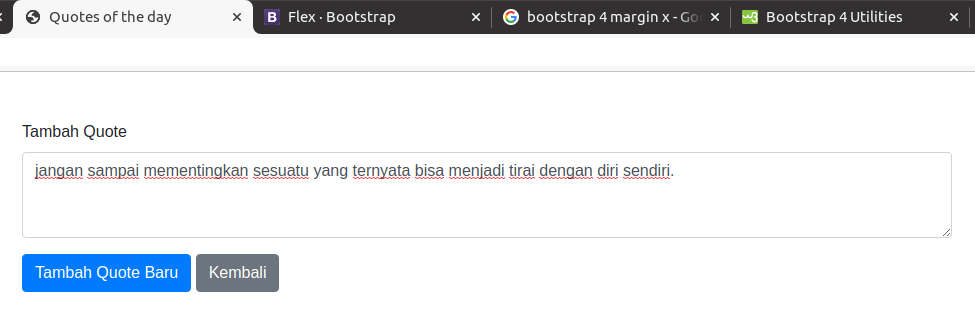
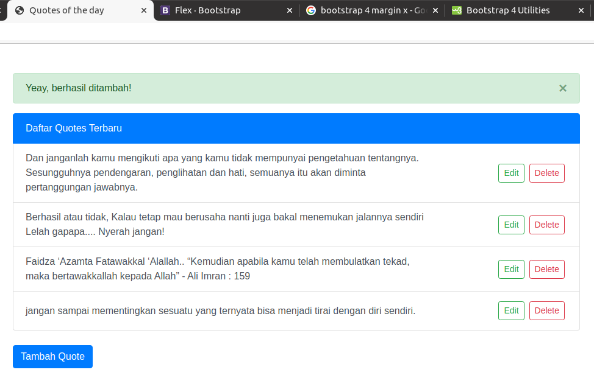
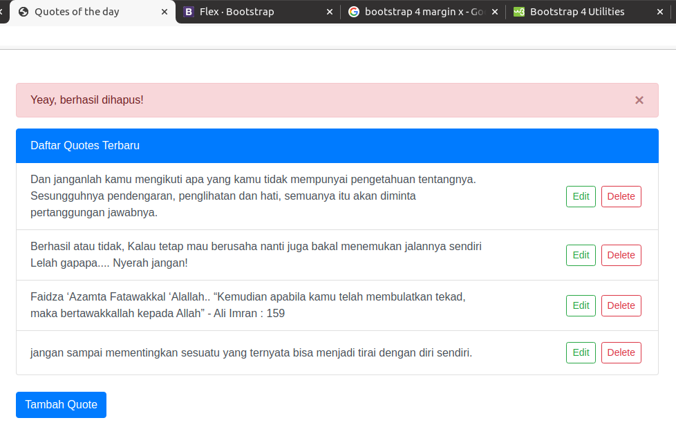

# Sinau Laravel






## Tech Stack

1. Laravel 5.8
1. PHP 7.4
1. Nginx 1.16
1. MySQL 5.7

## How to

```sh
git clone git@github.com:AndiSusanto15/Sinau-Laravel.git
cd Sinau-Laravel
cp .env.example .env
composer install
php artisan key:generate
php artisan migrate
```
